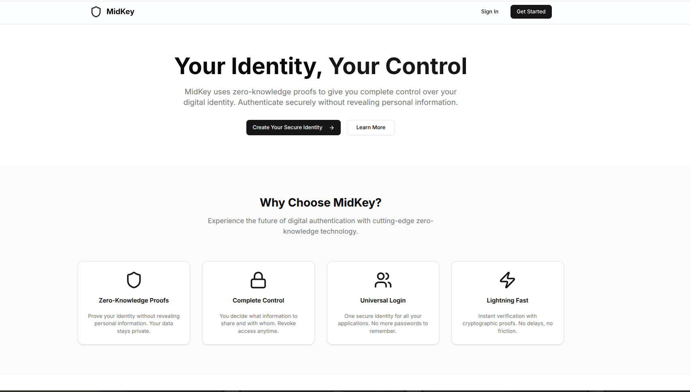
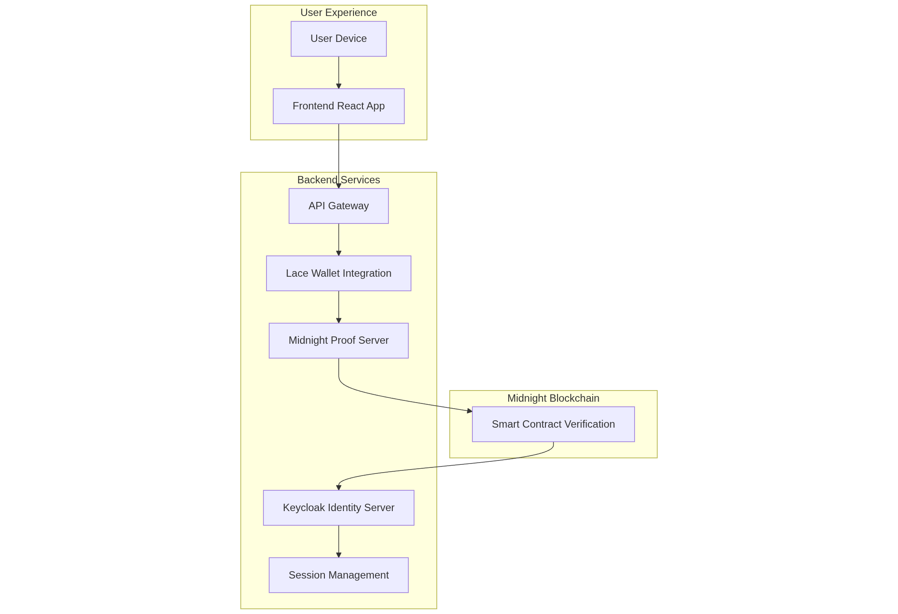
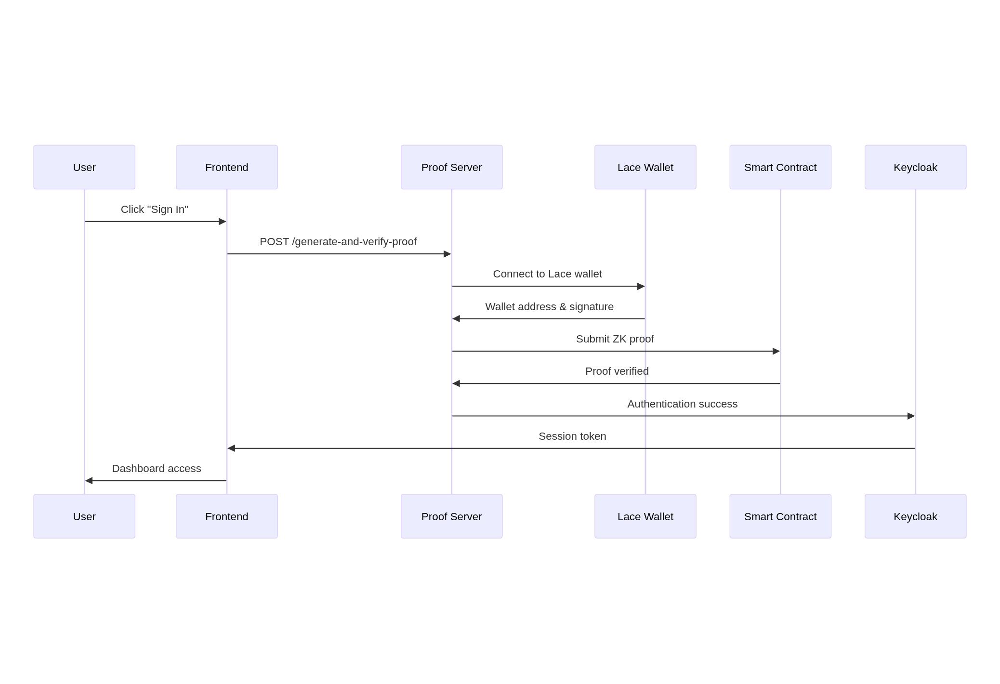

# MIDKEY - Zero-Knowledge Identity Platform

> **A decentralized identity platform built on Midnight blockchain that replaces passwords with zero-knowledge proofs**

[](https://opensource.org/licenses/MIT)
[](https://midnight.network)
[](https://en.wikipedia.org/wiki/Zero-knowledge_proof)

<div align="center">
  
  <p><em>MidKey System Overview - Zero-Knowledge Identity Platform</em></p>
</div>

## 🎯 **Executive Summary**

MidKey is a revolutionary authentication platform that eliminates the security vulnerabilities of traditional password-based systems. Built on the Midnight blockchain, it uses zero-knowledge proofs to enable users to prove their identity without revealing sensitive personal information.

### **The Problem We Solve**

- **Password Vulnerabilities**: Traditional passwords are the #1 security risk, constantly compromised in data breaches
- **Data Overexposure**: Users must share excessive personal data just to prove basic facts (like age verification)
- **Business Liability**: Companies face massive risks storing user passwords and personal data
- **User Friction**: Password fatigue leads to poor security practices and abandoned accounts

### **Our Solution**

MidKey replaces passwords with **cryptographic proofs** that allow users to prove facts about themselves without revealing the underlying data. Think of it as a "digital passport" that proves you're over 18 without showing your birthdate.

---

## **System Architecture**

<div align="center">
  
  <p><em>MidKey System Architecture - Component Relationships and Data Flow</em></p>
</div>

---

## **Quick Start**

### Prerequisites

- Node.js 18+ 
- Docker & Docker Compose
- Lace Wallet (for testing)
- Midnight Network access

### Installation

1. **Clone the repository**
   ```bash
   git clone https://github.com/your-org/midkey
   cd midkey
   ```

2. **Install dependencies**
   ```bash
   # Install root dependencies
   npm install
   
   # Install frontend dependencies
   cd frontend && npm install
   
   # Install proof-server dependencies
   cd ../proof-server && npm install
   ```

3. **Configure environment variables**
   ```bash
   # Copy environment template
   cp proof-server/.env.example proof-server/.env
   
   # Edit with your values
   nano proof-server/.env
   ```

4. **Start the system**
   ```bash
   # Terminal 1: Start Keycloak
   docker-compose up -d
   
   # Terminal 2: Start proof server
   cd proof-server && node lace-integration.js
   
   # Terminal 3: Start frontend
   cd frontend && npm run dev
   ```

5. **Access the application**
   - **Frontend**: http://localhost:3000
   - **Keycloak Admin**: http://localhost:8085 (admin/admin)
   - **Proof Server**: http://localhost:3001

---

## **Project Structure**

```
MidKey/
├── 📁 compact-contract/          # Midnight smart contract
│   ├── src/Verifier.compact      # Core ZK verification logic
│   └── contract-info.json        # Deployment details
├── 📁 frontend/                  # React/Next.js frontend
│   ├── app/                      # Next.js app router
│   ├── components/               # UI components
│   └── public/                   # Static assets
├── 📁 proof-server/              # Node.js backend
│   ├── lace-integration.js       # Lace wallet integration
│   └── .env                      # Environment config
├── 📁 keycloak-provider/         # Keycloak custom provider
│   └── keycloak/                 # Java identity provider
├── 📄 docker-compose.yml         # Keycloak orchestration
└── 📄 README.md                  # This file
```

---

## **Core Components**

### **1. Smart Contract (`compact-contract/`)**

**File**: `src/Verifier.compact`

The heart of MidKey's security model. This Compact smart contract:

- **Stores**: Public hash of user's secret (not the secret itself)
- **Verifies**: Zero-knowledge proofs without revealing private data
- **Maintains**: Privacy through round-based verification

```compact
export circuit verify(): [] {
  const sk = secretKey();                    // Get user's secret
  const pk = publicKey(round, sk);           // Calculate public key
  assert(authority == pk, "Invalid secret"); // Verify proof
  round.increment(1);                        // Enhance privacy
}
```

### **2. Proof Server (`proof-server/`)**

**File**: `lace-integration.js`

Handles the complex cryptography:

- **Integrates** with Lace wallet for user authentication
- **Generates** zero-knowledge proofs using Midnight Proof Server
- **Submits** proofs to the blockchain for verification
- **Manages** the entire authentication flow

**Key Endpoints**:
- `POST /generate-and-verify-proof` - Main authentication endpoint
- `GET /health` - Service health check
- `GET /wallet-info` - Wallet connection status

### **3. Frontend (`frontend/`)**

**Technology**: Next.js 14 + React + TypeScript

A complete user interface featuring:

- **Marketing Homepage** - Landing page with value proposition
- **Authentication Flow** - Seamless login experience
- **User Dashboard** - Identity management interface
- **Documentation** - User guides and API docs
- **Admin Portal** - Business management tools

### **4. Identity Management (`keycloak-provider/`)**

**Technology**: Java + Keycloak

Enterprise-grade identity management:

- **Custom Provider** - Java-based Keycloak extension
- **Session Management** - Secure token handling
- **Enterprise Integration** - SAML/OAuth2 support

---

## **Authentication Flow**

<div align="center">
  
  <p><em>MidKey Authentication Flow - Step-by-Step User Journey</em></p>
</div>

### **Step-by-Step Process**

1. **User Initiation**: User clicks "Sign In" on any integrated website
2. **Frontend Request**: Website redirects to MidKey authentication
3. **Wallet Connection**: System connects to user's Lace wallet
4. **Proof Generation**: Zero-knowledge proof created from user's secret
5. **Blockchain Verification**: Proof submitted to Midnight smart contract
6. **Identity Confirmed**: Contract verifies proof without revealing data
7. **Session Issued**: Keycloak creates secure session token
8. **Access Granted**: User logged in without sharing personal data

---

## **Development Guide**

### Environment Setup

```bash
# Required environment variables
CONTRACT_ADDRESS=0xde848af7977698
SECRET_KEY=19830@midkey
LACE_WALLET_ADDRESS=mn_shield-addr_test1dldxecrkvt68kezm6glvnsvpa5fm65plsdmqs8q8nclsdgqp8yjsxq92q6s99j7jmx4hc7vftgjz8j4pjezy69q0xa2zhjpnrvvv903xmg8nzzzs
```

### Running Tests

```bash
# Test proof server
curl -X POST http://localhost:3001/generate-and-verify-proof

# Test frontend API
curl -X POST http://localhost:3000/api/auth

# Test Keycloak
curl http://localhost:8085
```

### **Building for Production**

```bash
# Build frontend
cd frontend && npm run build

# Build Keycloak provider
cd keycloak-provider/keycloak && mvn clean install

# Deploy to production
docker-compose -f docker-compose.prod.yml up -d
```

---

## **Security Features**

### **Zero-Knowledge Proofs**
- **Privacy**: Users prove facts without revealing data
- **Security**: Cryptographic guarantees of authenticity
- **Efficiency**: Fast verification on blockchain

### **Decentralized Architecture**
- **No Single Point of Failure**: Distributed across Midnight network
- **User Control**: Users own their identity data
- **Transparency**: Open-source, auditable code

### **Enterprise Security**
- **Keycloak Integration**: Industry-standard identity management
- **Session Security**: Secure token handling
- **Compliance**: GDPR/CCPA ready architecture

---

## **Current Status**

### Completed Features

- [x] **Smart Contract**: Deployed and functional on Midnight testnet
- [x] **Proof Server**: Lace wallet integration working
- [x] **Frontend**: Complete user interface with authentication
- [x] **API Gateway**: RESTful endpoints for all services
- [x] **Documentation**: Comprehensive user and developer guides

### In Progress

- [ ] **Keycloak Provider**: Java compilation issues being resolved
- [ ] **Production Deployment**: Docker orchestration optimization
- [ ] **Mobile SDK**: React Native integration

### Roadmap

- [ ] **Q1 2024**: Enterprise Keycloak integration
- [ ] **Q2 2024**: Mobile applications (iOS/Android)
- [ ] **Q3 2024**: Advanced credential types
- [ ] **Q4 2024**: Multi-chain support

---

## Contributing

We welcome contributions! Please see our [Contributing Guidelines](CONTRIBUTING.md) for details.

### **Development Setup**

1. Fork the repository
2. Create a feature branch: `git checkout -b feature/amazing-feature`
3. Make your changes and add tests
4. Commit your changes: `git commit -m 'Add amazing feature'`
5. Push to the branch: `git push origin feature/amazing-feature`
6. Open a Pull Request

---

## **License**

This project is licensed under the MIT License - see the [LICENSE](LICENSE) file for details.

---

## **Support**

- **Email**: support@midkey.io
- **Discord**: [MidKey Community](https://discord.gg/midkey)
- **Documentation**: [docs.midkey.io](https://docs.midkey.io)
- **Issues**: [GitHub Issues](https://github.com/your-org/midkey/issues)

---

## **Acknowledgments**

- **Midnight Network** for the blockchain infrastructure
- **Lace Wallet** for wallet integration
- **Keycloak** for enterprise identity management
- **MLH Open Source Community** for the amazing tools and libraries

---

<div align="center">

**Built with ❤️ by the MidKey Team**

[Website](https://midkey.io) • [Documentation](https://docs.midkey.io) • [Community](https://discord.gg/midkey)

</div>